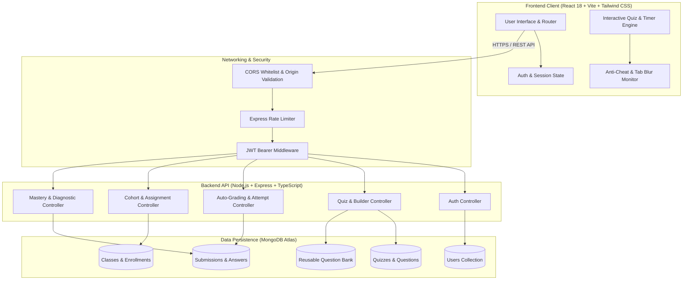

<div align="center">

# 🎓 QuizRoom (Room No. 518)
### Enterprise-Grade Full-Stack Educational Quiz & Assessment Platform

[](https://quiz-room-no-518-v4zq.vercel.app)
[](https://quiz-room-no-518.onrender.com/api/health)
[](https://www.typescriptlang.org/)
[](https://reactjs.org/)
[](https://nodejs.org/)
[](https://expressjs.com/)
[](https://www.mongodb.com/)
[](https://tailwindcss.com/)

<p align="center">
  <a href="https://quiz-room-no-518-v4zq.vercel.app"><strong>Explore Live Demo »</strong></a>
  <br />
  <a href="#-about-the-project">About The Project</a> •
  <a href="#-system-architecture">System Architecture</a> •
  <a href="#-key-features">Key Features</a> •
  <a href="#-security--integrity-safeguards">Security & Anti-Cheat</a> •
  <a href="#-demo-credentials">Demo Credentials</a> •
  <a href="#-getting-started">Local Setup</a>
</p>

</div>

---

## 📌 About The Project

**QuizRoom (Room No. 518)** is a modern, production-grade assessment and e-learning platform engineered to bridge the gap between classroom teaching and remote technical evaluations. 

Traditional online quiz apps often lack integrity safeguards, code formatting capabilities, or meaningful post-exam diagnostics. QuizRoom delivers a simulated digital exam hall:
- **For Educators:** A suite of authoring tools—including a dynamic drag-and-drop question builder, reusable question banks, automated grading, instant cohort analytics, and shareable QR codes.
- **For Students:** A distraction-free assessment environment featuring anti-cheat monitoring (tab-blur tracking), keyboard navigation, countdown timers, and immediate diagnostic post-exam reviews.

The platform is architected as an end-to-end TypeScript monorepo with an Express REST API backend connected to MongoDB Atlas and a React SPA client deployed globally on Vercel.

---

## 🏗️ System Architecture



---

## 🚀 Key Features

### 🎓 Student Experience
- **Open Self-Study & Custom Question Limits (No Teacher Required)**:
  - Take open assessments anytime across 8 core topics: **HTML**, **CSS**, **JavaScript**, **TypeScript**, **React**, **Next.js**, **Python**, and **Node.js**.
  - Choose your preferred test length: **10**, **15**, **25**, **30**, **50**, or **100** questions with proportionally scaled time limits.
  - Instant Self-Study Practice Room generator with automated grading and solution walkthroughs.
- **Interactive Exam Engine**:
  - Live countdown timer with automatic background submission upon expiry.
  - Multi-type questions: Multiple Choice (single/multi-select) and True/False questions.
  - Code syntax preview blocks tailored for technical exams.
  - Keyboard navigation shortcuts (`A`, `B`, `C`, `D` keys).
  - Visual question palette with answered vs. unanswered status indicators.
  - Pre-submission confirmation warning if unanswered items remain.
- **Anti-Cheating & Integrity Safeguards**:
  - Real-time window blur and tab-switching event detection.
  - Violation count tracking with alert toasts.
  - Optional Fullscreen focus lock during active attempts.
- **Instant Grading & Educational Review**:
  - Real-time automated scoring with pass/fail benchmarks and confetti animations.
  - Immutable question-by-question review with detailed explanations and correct answers revealed.
- **Performance Analytics & Learning Progression**:
  - Chronological test attempt timeline and score charts.
  - Subject-by-subject mastery bars across all 8 disciplines.
  - Rule-based learning insights recommending topics needing remediation.
- **Cohort Enrollment (Optional)**: Join university or school classes directly via teacher invite codes (e.g. `WEB-2026`).

---

### 👩‍🏫 Educator & Teacher Experience
- **Comprehensive Educator Analytics**:
  - Global cohort KPIs: overall student average, active quizzes, total attempts, students reached.
  - Student performance leaderboard (rank, attempts, average score, personal best).
  - Per-quiz diagnostic breakdown: question-by-question accuracy percentage and hardest concepts alert.
- **Dynamic Quiz Builder**:
  - Create, edit, clone as draft, archive, and delete quizzes.
  - Reorder questions up and down; duplicate existing questions with one click.
  - Attach syntax-highlighted code snippets, customizable point values, and educational answer explanations.
  - Import reusable items directly from the centralized **Question Bank**.
- **Centralized Question Bank**:
  - Global question repository categorized by Subject, Topic, and Difficulty.
  - Eliminates redundant test creation through reusable assessment modules.
- **Classes & Cohort Management**:
  - Create classes with auto-generated unique enrollment codes.
  - Manage student rosters and track cohort member progress.
  - Assign quizzes to classes with targeted submission deadlines and attempt limits.
- **Seamless Distribution**:
  - Instant modal with dynamically generated QR codes and one-click copyable share URLs.

---

## 🛡️ Security & Integrity Engineering

| Security Dimension | Implementation |
|---|---|
| **Stateless Authentication** | JSON Web Tokens (JWT) signed with HMAC-SHA256, transmitted via standard Bearer headers. |
| **Credential Protection** | Passwords salted and hashed with `bcryptjs` (cost factor 10). |
| **Sanitized Exam Delivery** | Quiz taking API (`/api/quizzes/:id/take`) strictly strips correct answers and explanations before transmitting questions to students to prevent client-side inspection vulnerabilities. |
| **Tamper-Proof Grading** | All answer validation and score calculations are executed server-side. |
| **Rate Limiting** | `express-rate-limit` prevents brute-force authentication and API abuse. |
| **CORS Policy** | Explicit origin validation whitelist supporting local development and production Vercel domains. |

---

## 🛠️ Technology Stack

| Domain | Technologies |
|---|---|
| **Frontend Client** | React 18, TypeScript, Vite, React Router DOM v6, Tailwind CSS, Lucide Icons, Canvas Confetti, QRCode.react |
| **Backend API** | Node.js, Express, TypeScript, Mongoose, JSONWebToken, Bcrypt.js, CORS, Express Rate Limit |
| **Database** | MongoDB Atlas (Cloud NoSQL Database) |
| **Cloud Deployment** | Vercel (Frontend SPA), Render (Backend Web Service) |

---

## 🔑 Demo Credentials

To test the application immediately on the [Live Demo](https://quiz-room-no-518-v4zq.vercel.app) or locally, use these pre-seeded accounts:

| Role | Email | Password | Pre-seeded Context |
|---|---|---|---|
| **Teacher (Primary)** | `teacher@example.com` | `password123` | Prof. Sarah Connor (Created quizzes, active class `WEB-2026`, cohort analytics) |
| **Teacher (Secondary)** | `alex.teacher@example.com` | `password123` | Alex Rivera (Draft quizzes, question bank author) |
| **Student (Primary)** | `student@example.com` | `password123` | David Miller (Historical attempts, score charts & subject mastery metrics) |
| **Student (Secondary)** | `emma.student@example.com` | `password123` | Emma Watson (Fresh enrolled student profile) |
| **Class Invite Code** | `WEB-2026` | — | Web Engineering Cohort 2026 |

---

## 📦 Getting Started

### 1. Prerequisites
- **Node.js**: v18 or higher (LTS recommended)
- **npm** or **pnpm**
- **MongoDB**: A local MongoDB server or a free [MongoDB Atlas Cluster](https://www.mongodb.com/cloud/atlas)

### 2. Clone Repository
```bash
git clone https://github.com/Nasir-Yousuf/quiz-room-no-518.git
cd quiz-room-no-518
```

### 3. Install Dependencies
Install dependencies for both client and server:
```bash
# Root and server dependencies
cd server
npm install

# Client dependencies
cd ../client
npm install

# Return to root
cd ..
```

### 4. Configure Environment Variables

#### Backend (`server/.env`):
```env
PORT=5000
MONGODB_URI=mongodb+srv://<username>:<password>@cluster0.mongodb.net/quiz_room_db?retryWrites=true&w=majority
JWT_SECRET=your_super_secret_jwt_key
NODE_ENV=development
CLIENT_ORIGIN=http://localhost:5173
```

#### Frontend (`client/.env`):
```env
# Leave blank in development to use Vite's built-in proxy to http://localhost:5000
VITE_API_URL=
```

### 5. Seed Database
Populate sample quizzes, question banks, student attempts, and classes:
```bash
cd server
npm run seed
```

### 6. Run the Application
From the project root:
```bash
# Run both frontend and backend concurrently
npm run dev
```

Or run services individually:
```bash
# Backend server (http://localhost:5000)
npm run dev:server

# Frontend client (http://localhost:5173)
npm run dev:client
```

---

## 📡 API Endpoints Reference

### 🔐 Authentication (`/api/auth`)
- `POST /api/auth/register` — Register a new student or educator account
- `POST /api/auth/login` — Authenticate and receive JWT Bearer token
- `GET /api/auth/me` — Retrieve authenticated user profile
- `PATCH /api/auth/profile` — Update name, email, or change password

### 📝 Quizzes (`/api/quizzes`)
- `GET /api/quizzes` — Browse published quizzes (with subject and difficulty filters)
- `POST /api/quizzes/practice` — Generate instant self-study practice quiz with custom question count
- `GET /api/quizzes/share/:shareCode` — Retrieve public quiz metadata via share code
- `GET /api/quizzes/:id/take` — Fetch sanitized questions for an active attempt (supports `?limit=15`)
- `GET /api/quizzes/teacher/mine` — Retrieve all quizzes authored by current educator
- `GET /api/quizzes/:id/editor` — Fetch complete quiz data including answer keys for authoring
- `POST /api/quizzes` — Create a new quiz
- `PATCH /api/quizzes/:id` — Update quiz configuration or questions
- `DELETE /api/quizzes/:id` — Remove a quiz
- `POST /api/quizzes/:id/duplicate` — Duplicate quiz as an independent draft

### ⏱️ Submissions & Attempts (`/api/attempts`)
- `POST /api/attempts/quizzes/:quizId/submit` — Submit answers for server-side evaluation & grading
- `GET /api/attempts/mine` — Retrieve logged-in student's historical attempts and statistics
- `GET /api/attempts/:id` — Detailed attempt review with explanations and answers
- `GET /api/attempts/quizzes/:quizId/teacher` — Educator overview of all student submissions for a quiz

### 📚 Question Bank (`/api/question-bank`)
- `GET /api/question-bank` — Filter reusable questions by subject, topic, and difficulty
- `POST /api/question-bank` — Add a new question to the bank
- `DELETE /api/question-bank/:id` — Remove a question from the bank

### 👥 Cohorts & Classes (`/api/classes`)
- `POST /api/classes` — Create a class cohort and generate unique invite code
- `GET /api/classes/teacher` — List all classes managed by educator
- `GET /api/classes/student` — List all classes enrolled by student
- `POST /api/classes/join` — Join a cohort using invite code
- `POST /api/classes/assignments` — Assign a quiz to a class with target deadline and attempt limit
- `GET /api/classes/assignments` — Fetch pending and submitted class assignments

### 📈 Analytics (`/api/analytics`)
- `GET /api/analytics/student` — Student mastery scores, timeline, and focus topics
- `GET /api/analytics/teacher` — Educator aggregate KPIs and student leaderboard
- `GET /api/analytics/quiz/:quizId` — Question-level accuracy percentages and hardest questions report

---

## 📄 License
This project is open-source and licensed under the [MIT License](LICENSE).
